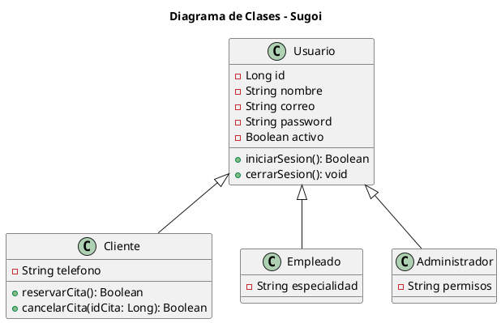
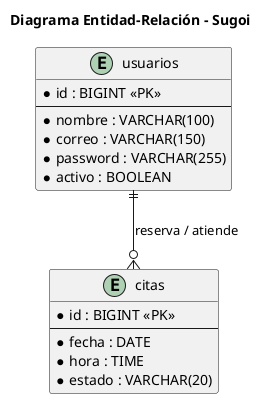

# Sugoi - Plataforma para Gestión de Citas

## Diagrama de Clases

```plantuml
@startuml
title Diagrama de Clases - Sugoi

class Usuario {
    -Long id
    -String nombre
    -String correo
    -String password
    -Boolean activo
    +iniciarSesion(): Boolean
    +cerrarSesion(): void
}

class Cliente {
    -String telefono
    +reservarCita(): Boolean
    +cancelarCita(idCita: Long): Boolean
}

class Empleado {
    -String especialidad
}

class Administrador {
    -String permisos
}

Usuario <|-- Cliente
Usuario <|-- Empleado
Usuario <|-- Administrador
@enduml
```

## Diagrama Entidad-Relación (DER)

```plantuml
@startuml
title Diagrama Entidad-Relación - Sugoi

entity "usuarios" as usuario {
  * id : BIGINT <<PK>>
  --
  * nombre : VARCHAR(100)
  * correo : VARCHAR(150)
  * password : VARCHAR(255)
  * activo : BOOLEAN
}

entity "citas" as cita {
  * id : BIGINT <<PK>>
  --
  * fecha : DATE
  * hora : TIME
  * estado : VARCHAR(20)
}

usuario ||--o{ cita : "reserva / atiende"
@enduml
```
