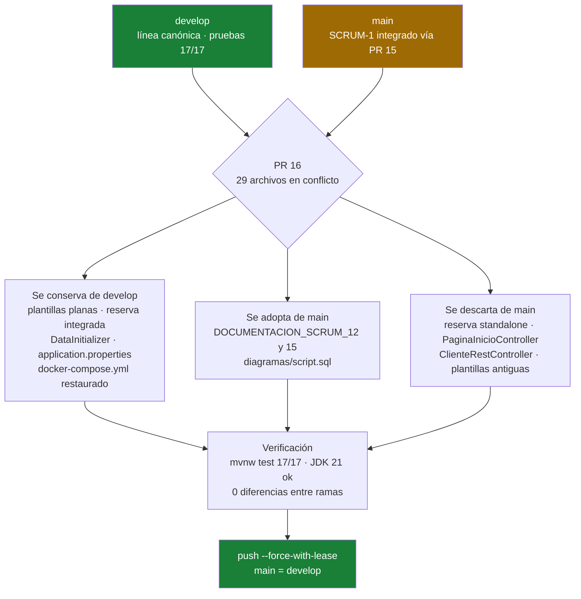

# Sincronización develop → main (Release Estable)

Documentación del proceso de sincronización entre las ramas `develop` y `main`, la resolución de conflictos del PR #16 y el estado final de la release.

## Resumen Ejecutivo

| Aspecto | Detalle |
|---|---|
| Trabajo realizado | Sincronización de `develop` → `main` para cerrar la release estable, resolviendo los **29 conflictos** del PR #16 |
| Estrategia | `develop` como línea canónica; adopción solo de aportes neutros de `main`; descarte de duplicados |
| Resultado | Ramas idénticas (`main` = `develop`), suite completa en verde (**17/17 pruebas**) y compilación JDK 21 correcta |
| Alcance funcional | Reserva de citas en línea (API de servicios/citas + disponibilidad), administración de servicios, registro/login y recuperación de cuenta |
| Responsable | Grupo 5 - Equipo de desarrollo |
| Evidencias | PRs #15, #16 y #18 · commits listados en la sección 4 · convención de commits `[SCRUM-x]` aplicada |

---

## 1. Contexto

El proyecto trabajó en paralelo sobre dos líneas de integración:

| Rama | Contenido |
|---|---|
| `develop` | Línea de trabajo del equipo: UI integrada al sistema de temas claro/oscuro, navegación compartida, reserva de citas integrada a las plantillas Thymeleaf (`templates/reservar-cita.html` + `static/js/reserva.js`) y las correcciones de esta iteración |
| `main` | Integración paralela del SCRUM-1 fusionada vía PR #15 desde `integration/SCRUM-1-citas`: versión standalone del frontend de reservas (`static/reserva.html` + `static/js/app.js`), plantillas reestructuradas en subcarpetas (`templates/admin/servicios/...`) y controladores adicionales |

Al abrir el **PR #16** (`develop` → `main`) Git reportó **29 archivos en conflicto**, porque ambas líneas contenían versiones distintas e incompatibles del mismo feature (SCRUM-1) y de la capa de presentación.

---

## 2. Conflictos Detectados

| Tipo | Archivos afectados |
|---|---|
| `add/add` (mismo archivo creado en ambas ramas) | `CitaController`, `ServicioRestController`, `CitaService`, `DataInitializer`, los 5 DTOs de citas/reserva, los 3 manejadores de excepciones, tests (`CitaReservaTests`, `DisponibilidadEndpointTests`), `styles.css` |
| `content` (modificado en ambas) | Modelos (`Usuario`, `Cliente`, `Empleado`, `Especialidad`, `Administrador`, `HorarioDisponibilidad`), repositorios (`CitaRepository`, `HorarioDisponibilidadRepository`), `pom.xml`, `application.properties` |
| `modify/delete` (eliminado en una rama, modificado en la otra) | `templates/admin/servicios/formulario.html`, `templates/admin/servicios/lista.html`, `templates/servicios/catalogo.html` |

---

## 3. Estrategia de Resolución

Se definió a **`develop` como línea canónica**: es la única con la suite de pruebas en verde (17/17), la UI integrada al diseño actual y todas las correcciones aplicadas.

### Se conservó de develop

- Toda la estructura de plantillas plana (`admin-servicios.html`, `reservar-cita.html`, etc.) conectada a los controladores vigentes.
- El flujo de reserva integrado (`reservar-cita.html` + `js/reserva.js`) en lugar del standalone.
- `DataInitializer` propio (con cuenta admin, datos demo ampliados y vínculos por rubro).
- `application.properties` funcional (MySQL en Docker + Mailtrap).
- `docker-compose.yml` (restaurado tras el merge, pues `main` lo había eliminado).

### Se adoptó de main (aportes neutros)

| Archivo | Motivo |
|---|---|
| `src/documentacion/DOCUMENTACION_SCRUM_12.md` | Documentación de la entrega |
| `src/documentacion/DOCUMENTACION_SCRUM_15.md` | Documentación de la entrega |
| `diagramas/script.sql` | Script SQL del DER |

### Se descartó de main (duplicados o incompatibles)

| Archivo | Motivo |
|---|---|
| `static/reserva.html` + `static/js/app.js` | Reemplazados por la vista integrada `reservar-cita.html` + `js/reserva.js` |
| `PaginaInicioController.java` | Mapeaba `GET /` y entraba en conflicto con `AuthController.raiz()` (dos controladores sobre la misma ruta impiden arrancar Spring) |
| `ClienteRestController.java` + `ClienteResponseDTO.java` | Solo servían al frontend standalone descartado |
| Plantillas reestructuradas (`templates/admin/servicios/...`, `templates/servicios/catalogo.html`) | Pertenecen a la estructura antigua; ninguna vista actual las referencia |

### Cuadro del proceso

---

## 4. Commits de la Release

Convención aplicada: `[SCRUM-x] Nombre del integrante: descripción`. Un autor por commit según quién realizó cada trabajo.

| SHA | Código SCRUM | Contenido |
|---|---|---|
| `16182b3` | `[SCRUM-1]` | Reserva de citas en línea: API de servicios/citas, disponibilidad por empleado y fecha, vista `reservar-cita` con JS, accesos en navegación e inicio, tests |
| `2c34562` | `[SCRUM-7]` | Corrección de `LazyInitializationException` en el listado admin de servicios (JOIN FETCH de categorías) |
| `77fc8fe` | `[SCRUM-7]` | Diseño: barra de navegación fija a todo lo ancho y selects legibles en modo oscuro (`color-scheme: dark`), limpieza de `.gitignore` |
| `83438f5` | `[SCRUM-1]` | Ampliación de datos demo: categoría Barbería y Estilo, 4 servicios de barbería, nuevos especialistas, inicialización idempotente |
| `0639c5b` | `[SCRUM-1]` | Especialistas vinculados solo a los servicios de su rubro (la disponibilidad ya no muestra barberos en servicios de salud ni viceversa) |
| `fe160ed` | `[SCRUM-7]` | Integración de origin/main a develop (merge canónico, adopción de documentación y script.sql, descarte de duplicados) |
| `69f2cdd` | `[SCRUM-7]` | Créditos de autoría en comentarios del código |

La autoría del trabajo también quedó registrada en los comentarios del código fuente (`CitaController.java`, `DataInitializer.java`), indicando el SCRUM correspondiente y el tipo de aporte.

---

## 5. Corrección de la Convención de Commits

Durante la revisión se detectó que el commit de merge había quedado sin el formato exigido y que los mensajes mezclaban dos nombres en un mismo commit. Se corrigió así:

1. Se reescribieron los mensajes con `git filter-branch --msg-filter` sobre el rango `c100846..develop` (preserva padres de merge y contenido de los árboles).
2. Cada commit quedó con **un único responsable**, coherente con lo que realmente hizo.
3. Se publicó con `git push --force-with-lease` en `develop` y se alineó `main` (`+develop:main`) para que ambas ramas queden idénticas.

> **Nota para el equipo:** como el historial fue reescrito, quien tenga un clon anterior debe sincronizar con `git pull --rebase origin develop` o volver a clonar antes de continuar.

---

## 6. Verificación Final

| Verificación | Resultado |
|---|---|
| `mvnw test` después del merge | 17/17 pruebas exitosas (contexto, reserva, disponibilidad, registro, admin de servicios, servicio de usuarios) |
| Compilación JDK 21 (`mvnw compile`) | Correcta |
| Diferencias `origin/main` vs `origin/develop` | 0 archivos — ramas idénticas |
| Estado final sincronizado | `main` = `develop` = `6e92256` (incluye esta documentación; el merge cerró en `69f2cdd`) |
| Validaciones de entidades en main | `Cita`, `CategoriaServicio` y `Servicio` presentes, con `@NotBlank`/`@NotNull`/`@Size`/`@Positive`/`@DecimalMin` y mensajes personalizados |
| Pendiente intencional sin commitear | `.idea/compiler.xml` y cambios de modo de `mvnw` (ruido de IDE, excluidos a propósito) |

---

## 7. Notas Técnicas

- **Resolución de conflictos:** para cada archivo en conflicto se tomó la versión de `develop` (`git checkout --ours`); los `modify/delete` de plantillas se resolvieron con `git rm` manteniendo la eliminación ya decidida en develop.
- **Archivos restaurados tras el merge:** `docker-compose.yml` se recuperó con `git restore --source=HEAD --staged --worktree` porque la eliminación provenía de `main`.
- **Verificación anti-marcadores:** se escaneó el árbol buscando restos de `<<<<<<<` / `>>>>>>>` antes de confirmar el merge.
- **Reescritura segura:** el force-push se hizo siempre con `--force-with-lease` para no pisar trabajo remoto desconocido.
- **Windows:** se desactivó `core.filemode` para ignorar los falsos cambios de bit de ejecución en `mvnw`.

---

*Documento de entrega — Grupo 5*
